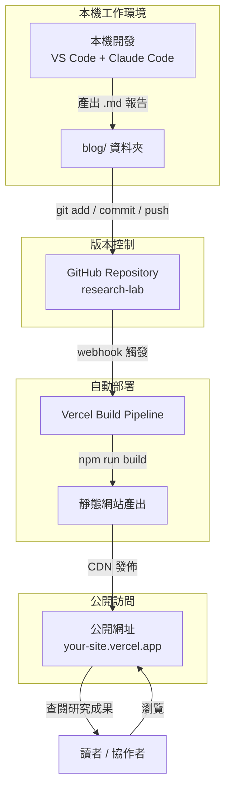

今天完成了研究日誌系統的完整建置：從本機 Docusaurus 專案，到 GitHub 版本控制，再接上 Vercel 自動部署，形成完整的 docs-as-code 工作流程。

<!-- truncate -->

## 提示詞區塊

以下是本次實驗使用的核心提示詞：

```text
任務：建立一套可持續運作的 AI 研究日誌系統

需求：
1. 使用 Docusaurus 作為靜態網站框架（blog 模式作為日誌）
2. 每篇日誌包含：提示詞紀錄、架構圖、Demo 說明三個固定區塊
3. 透過 git push 觸發 Vercel 自動重新部署
4. 公開網址讓研究成果可被他人查閱

工作流程：
- Claude Code 產出 .md 報告 → git push → Vercel 自動建站
- 不需要手動操作任何後台，全自動 CI/CD
```

---

## 架構圖區塊

本次建置的完整系統架構與部署流程：



---

## Demo 說明區塊

### 本次實驗內容

**目標：** 建立可持續運作的 AI 研究日誌發佈系統，讓每天的實驗成果能自動上線。

**執行步驟：**

1. **建立 Docusaurus 專案** — `npx create-docusaurus@latest research-lab classic`，選用 JavaScript 版本，在本機確認 `npm start` 可正常運行
2. **設定 blog 作為日誌系統** — 刪除預設範例文章，建立標準化的日誌模板（提示詞 / 架構圖 / Demo 三區塊）
3. **推上 GitHub** — 初始化 git repo，建立 `.gitignore`，完成首次 commit 與 push
4. **接上 Vercel 自動部署** — 透過 GitHub 登入 Vercel，匯入 repo，選擇 Docusaurus framework，自動完成部署設定

**實驗結果：**

| 項目 | 狀態 |
|------|------|
| 本機開發環境 | 正常運行 |
| GitHub 版本控制 | 已推送 |
| Vercel 自動部署 | 已連接 |
| 公開網址 | 上線中 |

**學到的關鍵概念：**

- **docs-as-code** — 文件和程式碼一樣走 git 版本控制
- **CI/CD 自動化** — push 觸發 build，不需要手動部署
- **Mermaid 語法** — 在 Markdown 裡直接畫架構圖，版本控制友善
- **靜態網站優勢** — 無伺服器、免費部署、全球 CDN 加速

**下一步計畫：**

- 每天用 Claude Code 做一個 AI 應用實驗
- 產出標準格式的 `.md` 報告放進 `blog/`
- 透過 git push 自動更新公開網站
- 持續累積可公開展示的研究成果
