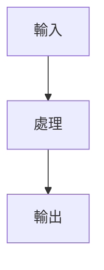

今天的實驗摘要，一兩句說明做了什麼。

{/* truncate */}

## 提示詞區塊

```text
在這裡貼上今天用的提示詞
```

---

## 架構圖區塊


```mermaid
flowchart TD
    A[輸入] --> B[處理] --> C[輸出]
```

---

## Demo 說明區塊

**目標：** 說明今天的實驗目的

**結果：** 說明實驗結果

**學到：** 學到什麼
